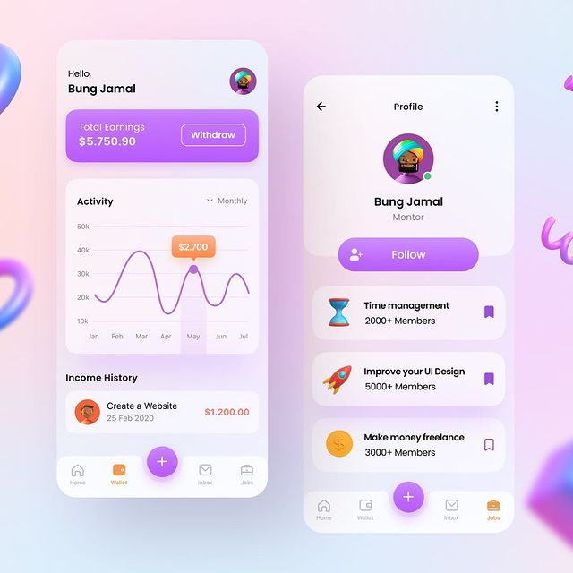

# Flutter UI Challenges

I'm really exiceted when join into the Flutter UI Challenge in 100 Days with references challenge from the [View Reference Challenge](https://awesomeopensource.com/project/pedromassango/my_flutter_challenges) and some websites on the internet.

## Building and running the code [ **Updated** ]

### Table of contents
- Day 1 **[E-Wallet](#E-Wallet)**

## Packages Used

- Flutter Challenge Website (https://awesomeopensource.com/project/pedromassango/my_flutter_challenges)
- Github Repository Reference Website (https://github.com/lohanidamodar/flutter_ui_challenges)
- Flutter Plugin  (https://pub.dev/)

## E-Wallet

